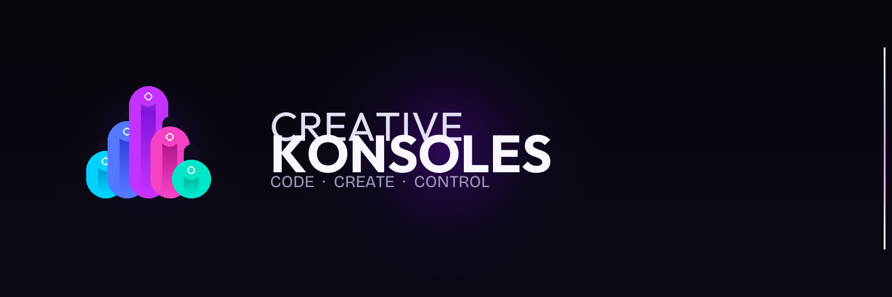

<div align="center">
  
</div>

<br>

<div align="center">

### Jeremiah Smith
#### Founder & Lead Developer — Creative Konsoles

*Code · Create · Control*

</div>

---

> *"These software creations are an extension of my love of music and basketball and their synergy with math and the economics of that on society at large."*
>
> — Jeremiah Smith

---

## Who I Am

I'm a software developer, music maker, and basketball lifer based in the Northeast. I build tools that sit at the intersection of things I love — the precision of a well-designed system, the feel of a fader moving in the right direction, the instinct that tells you when something is mispriced before anyone else sees it.

I started **Creative Konsoles** because the software I wanted didn't exist. So I built it. Then I built more. That's how this goes.

When I'm not shipping code, I'm either on the court, in the studio, or somewhere quiet — meditating, watching how the pieces connect.

Twin daughters. Twelve years old. Everything else follows from that.

---

## What I Build

Everything I build runs on a simple philosophy: **the interface should feel like a machine.** Not a form. Not a dashboard. A machine — something you pick up and immediately know how to play, something that rewards precision and gives you control without requiring you to read a manual.

That's Creative Konsoles.

---

## The Suite

<table>
<tr>
<td width="100%" valign="top">

### 🚀 Flagships

**[5i — Five Intelligences](https://creativekonsoles.com)** &nbsp;`LIVE`
One prompt. Five AI models simultaneously. GPT · Claude · Gemini · Grok · Mistral — running in parallel, synthesized into one unified verdict. The fastest way to know what the best AI minds agree on. Live at **creativekonsoles.com**.

**[5i × Kalshi — AI Edge Detector](https://web-production-041d1.up.railway.app/kalshi-fusion)** &nbsp;`LIVE`
Five AI models analyzing live Kalshi prediction markets simultaneously. Alpha gap detection — difference between market price and AI consensus. Trade/Skip signal with confidence score. Direct order execution. Built on the 5i parallel engine, aimed at one specific problem: **find what the market has wrong.**

</td>
</tr>
<tr>
<td width="50%" valign="top">

### Tools

**🎛 [Kode Keeper](https://github.com/papjamzzz/kodekeeper)**
Claude Code mission control. Context oscilloscope, usage VU meters, cost tracker, live project patch bay. The control room for AI-assisted development.

**📡 [Kalshi Konnektor](https://github.com/papjamzzz/kalshi-konnektor)**
Real-time edge detection for Kalshi prediction markets. Four-signal scoring engine. Guitar-pedal-style controls. Find what the market misses.

**🤖 [KK Trader](https://github.com/papjamzzz/kalshi-trader)**
Fully autonomous trading engine for Kalshi. Runs 24/7. Scans, enters, monitors, exits — without you touching a thing. Factory without lights.

</td>
<td width="50%" valign="top">

### &nbsp;

**🎬 [StreamFader](https://github.com/papjamzzz/Stream-Fader)**
DJ-style crossfader for streaming content. Blend critic and audience scores in real time. Find what's actually worth watching.

**🔊 [TrackTracks](https://github.com/papjamzzz/Track-Tracks)**
Per-track CPU monitor for Ableton Live. Stop guessing which plugin is killing your session. Know exactly which track, which device, in real time.

**🩺 [DAW Doctor](https://github.com/papjamzzz/Daw-Doctor)**
Diagnostic tool for Ableton Live producers. Scan your system, analyze your session, fix what's breaking your music.

</td>
</tr>
</table>

---

## Stack

```
Python · Flask · Vanilla JS · Claude AI · OpenAI · Gemini · Grok · Mistral
Kalshi API · Ableton Live · PyQt6 · Stripe · macOS
```

Dark themes. Hardware aesthetics. No external frameworks. Always localhost first.

---

## Philosophy

The fader is a perfect piece of technology. It has one job. It does it with total precision. You know exactly where you are at every moment and exactly how to get somewhere else. Every tool I build is trying to be that.

Music and basketball taught me the same thing: **systems reward the people who understand them before everyone else does.** Math is underneath both. So is instinct. The best developers, like the best players and the best producers, are the ones who have internalized the system so completely that they're no longer thinking about it — they're just moving.

---

<div align="center">

**Creative Konsoles** &nbsp;·&nbsp; Always building &nbsp;·&nbsp; [@papjamzzz](https://github.com/papjamzzz) &nbsp;·&nbsp; [𝕏 @creativekonsole](https://x.com/creativekonsole)

</div>
