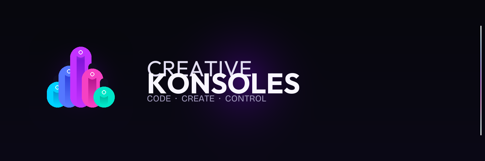

<div align="center">
  
</div>

<br>

<div align="center">

### Jeremiah Smith
#### Founder & Lead Developer — Creative Konsoles

*Code · Create · Control*

</div>

---

> *"These software creations are an extension of my love of music and basketball and their synergy with math and the economics of that on society at large."*
>
> — Jeremiah Smith

---

## Who I Am

I'm a software developer, music maker, and basketball lifer based in the Northeast. I build tools that sit at the intersection of things I love — the precision of a well-designed system, the feel of a fader moving in the right direction, the instinct that tells you when something is mispriced before anyone else sees it.

I started **Creative Konsoles** because the software I wanted didn't exist. So I built it. Then I built more. That's how this goes.

When I'm not shipping code, I'm either on the court, in the studio, or somewhere quiet — meditating, watching how the pieces connect.

Twin daughters. Twelve years old. Everything else follows from that.

---

## What I Build

Everything I build runs on a simple philosophy: **the interface should feel like a machine.** Not a form. Not a dashboard. A machine — something you pick up and immediately know how to play, something that rewards precision and gives you control without requiring you to read a manual.

That's Creative Konsoles.

---

## The Suite

<table>
<tr>
<td width="100%" valign="top">

### 🚀 Flagships

**[5i — Five Intelligences](https://creativekonsoles.com)** &nbsp;`LIVE`  
One prompt. Five AI models simultaneously. GPT · Claude · Gemini · Grok · Mistral — running in parallel, synthesized into one unified verdict. Live at **creativekonsoles.com**.

**[AILIV — Biohacking Dashboard](https://ailiv.health)** &nbsp;`LIVE`  
40 live biomarker orbs across 4 orbital rings. AI health synthesis via GPT-4, Claude, and Gemini. Not a health app — a health engine. Live at **ailiv.health**.

**[Memoir — Voice-to-Story AI Journaling](https://memoir.creativekonsoles.com)** &nbsp;`LIVE`  
Speak your story. AI structures, preserves, and returns it as a living document. Voice-first journaling for people who think faster than they type. Live at **memoir.creativekonsoles.com**.

**[5i × Kalshi — AI Edge Detector](https://github.com/papjamzzz/kalshi-trader)** &nbsp;`LIVE`  
Five AI models analyzing live Kalshi prediction markets simultaneously. Alpha gap detection — difference between market price and AI consensus. Direct order execution.

</td>
</tr>
<tr>
<td valign="top">

### 🛠 Tools

<table>
<tr>
<td width="50%" valign="top">

**🎛 [Kode Keeper](https://github.com/papjamzzz/kodekeeper)**  
Claude Code mission control. Context oscilloscope, usage VU meters, cost tracker, live project patch bay.

**📡 [Kalshi Konnektor](https://github.com/papjamzzz/kalshi-konnektor)**  
Real-time edge detection for Kalshi prediction markets. Four-signal scoring engine. Guitar-pedal-style controls.

**🤖 [KK Trader](https://github.com/papjamzzz/kalshi-trader)**  
Fully autonomous trading engine for Kalshi. Runs 24/7. Scans, enters, monitors, exits — without you touching a thing.

**🔑 [Key Watcher](https://github.com/papjamzzz/key-watcher)**  
API key health monitor. Live spend tracking, quota alerts, and status lights for every AI provider in one panel.

**📦 [Check'd](https://github.com/papjamzzz/checkd)**  
AI-vetted product discovery. Every listing verified by Claude before it goes live. Signal over noise.

**🎙 [Memoir](https://github.com/papjamzzz/memoir)**
Voice-to-story AI journaling. Speak naturally — Claude structures it into a living, searchable life document. Privacy-first. No typing required.

**🧬 [AILIV / Grail](https://github.com/papjamzzz/grail)**
Luxury biohacking dashboard. 40 live biomarker orbs, 4 orbital rings, AI health synthesis via GPT, Claude, and Gemini.

</td>
<td width="50%" valign="top">

**🎬 [StreamFader](https://github.com/papjamzzz/Stream-Fader)**  
DJ-style crossfader for streaming content. Blend critic and audience scores in real time.

**🔊 [TrackTracks](https://github.com/papjamzzz/Track-Tracks)**  
Per-track CPU monitor for Ableton Live. Know exactly which plugin is killing your session.

**🩺 [DAW Doctor](https://github.com/papjamzzz/producer-vault)**  
Auto-backup for Ableton Live. Continuous diff-aware versioning, instant restore from any save point. Never lose a session.

**💞 [WithYou](https://github.com/papjamzzz/empathybot)**
Voice-first AI wellness companion. 12 support types — grief, trauma, anxiety, illness. CE listens, responds with empathy, speaks back.

**⚖️ [Represented](https://github.com/papjamzzz/represented)**
AI legal platform for self-represented litigants. Upload motions, log incidents, draft responses, research your judge. The edge preparation gives you — without a lawyer.

**₿ [Crypto Grid](https://github.com/papjamzzz/crypto-grid)**
Autonomous crypto grid trading bot. Self-adjusting buy/sell ladder for BTC-USD. Runs 24/7 on Railway. Paper mode + live execution.

**🎛 [Control](https://github.com/papjamzzz/control)**
Physical MIDI control layer for Claude Code. Map a Korg nanoKONTROL2 to AI behavior in real time. Four tracks, twelve parameters — dial in how Claude thinks and acts. A DAW for AI coding agents.

</td>
</tr>
</table>

---

## Live URLs

| Product | Status | URL |
|---------|--------|-----|
| 5i — Five Intelligences | ✅ Live | [creativekonsoles.com](https://creativekonsoles.com) |
| AILIV — Biohacking Dashboard | ✅ Live | [ailiv.health](https://ailiv.health) |
| Memoir — AI Journaling | ✅ Live | [memoir.creativekonsoles.com](https://memoir.creativekonsoles.com) |
| StreamFader | ✅ Live | [stream.creativekonsoles.com](https://stream.creativekonsoles.com) |
| DAW Doctor | ✅ Live | [dawdoctor.creativekonsoles.com](https://dawdoctor.creativekonsoles.com) |
| Control | ✅ Live | [github.com/papjamzzz/control](https://github.com/papjamzzz/control) |
| Represented | ✅ Live | [github.com/papjamzzz/represented](https://github.com/papjamzzz/represented) |
| Kode Keeper | ✅ Live | [keeper.creativekonsoles.com](https://keeper.creativekonsoles.com) |
| Me-Chanic | ✅ Live | [me-chanic.vercel.app](https://me-chanic.vercel.app) |
| KK Trader | ✅ Live | [github.com/papjamzzz/kalshi-trader](https://github.com/papjamzzz/kalshi-trader) |
| Kalshi Konnektor | ✅ Live | [github.com/papjamzzz/kalshi-konnektor](https://github.com/papjamzzz/kalshi-konnektor) |
| TrackTracks | ✅ Live | [github.com/papjamzzz/Track-Tracks](https://github.com/papjamzzz/Track-Tracks) |
| Crypto Grid | ✅ Live | [github.com/papjamzzz/crypto-grid](https://github.com/papjamzzz/crypto-grid) |
| AILIV / Grail | ✅ Live | [github.com/papjamzzz/grail](https://github.com/papjamzzz/grail) |
| WithYou | 🔒 Private Alpha | — |

---

## Stack

```
Python · Flask · Vanilla JS · React · Next.js · Claude AI · OpenAI · Gemini · Grok · Mistral
Kalshi API · Ableton Live · MIDI · nanoKONTROL2 · Railway · Vercel · macOS
```

Dark themes. Hardware aesthetics. No external frameworks. Always localhost first.

---

## Philosophy

The fader is a perfect piece of technology. It has one job. It does it with total precision. You know exactly where you are at every moment and exactly how to get somewhere else. Every tool I build is trying to be that.

Music and basketball taught me the same thing: **systems reward the people who understand them before everyone else does.** Math is underneath both. So is instinct. The best developers, like the best players and the best producers, are the ones who have internalized the system so completely that they're no longer thinking about it — they're just moving.

---

<div align="center">

**Creative Konsoles** &nbsp;·&nbsp; Always building &nbsp;·&nbsp; [@papjamzzz](https://github.com/papjamzzz) &nbsp;·&nbsp; [𝕏 @RealRealEyes](https://x.com/RealRealEyes)

</div>
